<!--
Title: Abdallah Dib personal website
  Description: Abdallah Dib Deeb website, computer vision and machine learning scientist (computer graphics, rendering, deep learning, CV, face tracking, motion capture, 3D, game programming, C, C++, pytorch, python, objective-C, OpenGL, 3D graphics)
  Author: Abdallah Dib
  -->
  <meta name='keywords' content='abdallah dib, abdallah deeb, machine learning, computer vision, computer graphics, rendering, deep learning, CV, face tracking, motion capture, 3D, game programming, C, C++, pytorch, python, objective-C, OpenGL, 3D graphics'>
 
 <meta name="description" content="Abdallah Dib Deeb website, computer vision and machine learning scientist (computer graphics, rendering, deep learning, CV, face tracking, motion capture, 3D, game programming, C, C++, pytorch, python, objective-C, OpenGL, 3D graphics)">
  
## About me
I am a research scientist working at Ubisoft La Forge (Montreal). Before that I worked as a senior research scientist at InterDigital R&I France since 2019. Previously, I held the same position at Technicolor research (2017-2019) and I worked as a research engineer at Inria (from 2008-2012).

I received my Phd in Computer Science from Inria research center in 2016.

My research interests are at the intersection of computer vision, machine learning and graphics. I apply deep learning and numerical optimization for scene understanding from images and videos.

<!---<a href="mailto:deeb.abdallah@gmail.com">Looking for internship/PhD? click here to contact me by email, I may have some cool open positions for you</a>. -->
<a href="mailto:deeb.abdallah@gmail.com">I'm actively searching for PhD student(s) to join our team and contribute to pushing the boundaries of realistic avatar creation. If you're motivated, passionate, and interested in working on this topic, please send me an email with your CV.</a> 

## News
* **09/03/2024**: We released **FFHQ-UV-Intrinsics** dataset that contains intrinsics texture maps for 10K subjects at HD resolution. Download it from [here](https://github.com/ubisoft/ubisoft-laforge-FFHQ-UV-Intrinsics) 
* **01/03/2024**: Mosar paper got accepted to CVPR 2024. MoSAR turns a portrait image into a relightable 3D avatar. More details from [Here](https://ubisoft-laforge.github.io/character/mosar/)
* **18/05/2022**: DeepNextFace is a 3D face reconstruction library from a single monocular RGB image via deep convolutional neural networks and differentiable ray tracing. Check it from [https://github.com/abdallahdib/DeepNextFace]( https://github.com/abdallahdib/DeepNextFace)
* **21/04/2022**: NextFace is a lightweight open source library, written in pytorch, for high fidelity face reconstruction. Check it from [https://github.com/abdallahdib/NextFace]( https://github.com/abdallahdib/NextFace)

## Publications

  <strong>MoSAR: Monocular Semi-Supervised Model for Avatar Reconstruction using Differentiable Shading</strong> 
  <small>Abdallah Dib, Luiz Gustavo Hafemann, Emeline Got, Trevor Anderson, Amin Fadaeinejad, Rafael M. O. Cruz, Marc-Andre Carbonneau</small> 
  <i> IEEE / CVF Computer Vision and Pattern Recognition Conference (CVPR 2024)
</i> 
  <a href="https://arxiv.org/abs/2312.13091">pre-print</a> |
  <a href="https://ubisoft-laforge.github.io/character/mosar/">Project page</a> |
  <a href="https://github.com/ubisoft/ubisoft-laforge-FFHQ-UV-Intrinsics">Dataset</a> |
    
  <video width="100%" preload="auto" muted controls>
    <source src="images/mosar.mov" type="video/mp4">
</video>

  <strong>S2F2: Self-Supervised High Fidelity Face Reconstruction From Monocular Image</strong> 
  <small>Abdallah Dib, Cedric Thebault, Junghyun Ahn, Philippe-Henri Gosselin, Louis Chevallier</small> 
  <i>International Conference on Automatic Face and Gesture Recognition FG 2023
</i> 
  <a href="https://arxiv.org/abs/2203.07732">pre-print</a> |
  <a href="https://youtu.be/DiHpZjx1sxc">video</a> |
    
  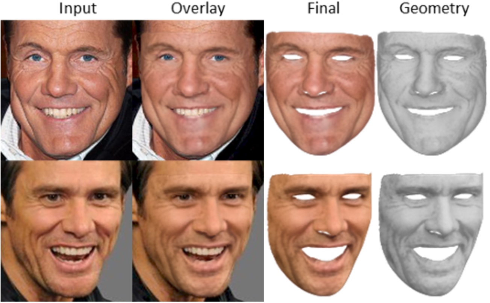

  <strong>Practical Face Reconstruction via Differentiable Ray Tracing</strong> 
  <small>Abdallah Dib, Gaurav Bharaj, Junghyun Ahn, Cédric Thébault, Philippe-Henri Gosselin, Marco Romeo, Louis Chevallier</small> 
  <i>Computer Graphics Forum, Eurographics' 2021</i> 
  <a href="https://arxiv.org/abs/2101.05356">paper</a> |
  <a href="https://youtu.be/bPFp0oZ9plg">video</a> |
  <a href="https://github.com/abdallahdib/NextFace">code</a>
    
  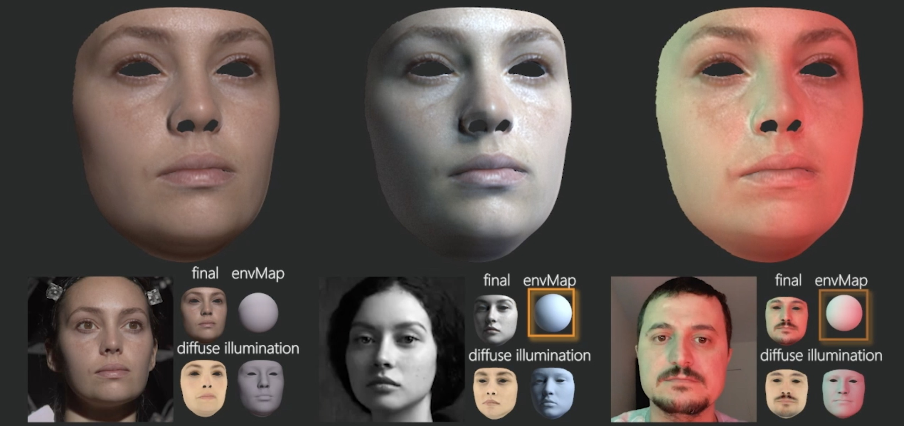

  <strong>Towards High Fidelity Monocular Face Reconstruction with Rich Reflectance using Self-supervised Learning and Ray Tracing</strong> 
  <small>Abdallah Dib, Cedric Thebault, Junghyun Ahn, Philippe-Henri Gosselin, Christian Theobalt, Louis Chevallier</small> 
  <i>International Conference on Computer Vision (ICCV 2021) </i> 
  <a href="https://arxiv.org/abs/2103.15432">paper</a> |
  <a href="https://www.youtube.com/watch?v=VVr_bbXEjxE">video</a> |
  <a href="https://github.com/abdallahdib/DeepNextFace">code</a>
    
  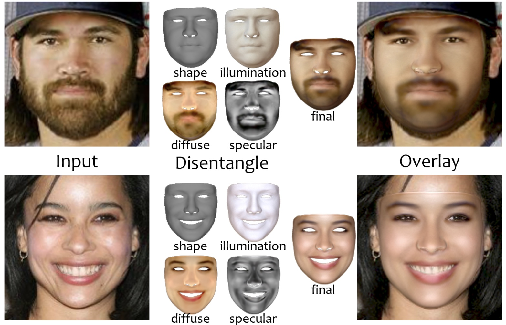

  <strong>PhotoApp: Photorealistic Appearance Editing of Head Portraits</strong> 
  <small>Mallikarjun B R, Ayush Tewari, Abdallah Dib, Tim Weyrich, Bernd Bickel, Hans-Peter Seidel, Hanspeter Pfister, Wojciech Matusik, Louis Chevallier, Mohamed Elgharib, Christian Theobalt</small> 
  <i>ACM Transactions on Graphics (SIGGRAPH Asia 2021)</i> 
  <a href="https://arxiv.org/abs/2103.07658">paper</a> |
  <a href="http://gvv.mpi-inf.mpg.de/projects/PhotoApp/">video</a>
    
  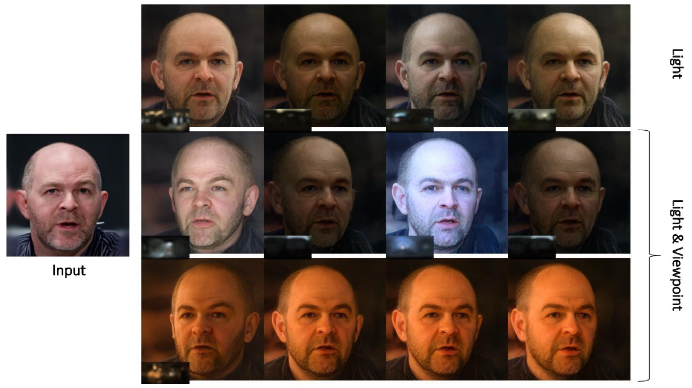

  <strong>FaceLab: Scalable Facial Performance Capture for Visual Effects</strong> 
  <small>Andrus, Curtis and Ahn, Junghyun and Alessi, Michele and Dib, Abdallah and Gosselin, Philippe and Thébault, Cédric and Chevallier, Louis and Romeo, Marco</small> 
  <i>The Digital Production Symposium (DigiPro 2020)</i> 
  <a href="https://dl.acm.org/doi/pdf/10.1145/3403736.3403938">paper</a>
    
  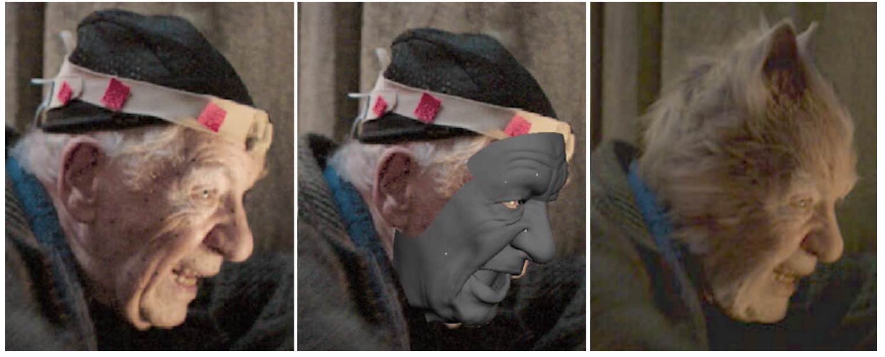

  <strong>Pose Estimation For A Partially Observable Human Body From RGB-D Cameras</strong> 
  <small>Abdallah Dib, François Charpillet</small> 
  <i>IEEE/RSJ International Conference on Intelligent Robots and Systems  (IROS 2015)</i> 
  <a href="https://hal.inria.fr/hal-01203638/document">paper</a> |
  <a href="https://www.youtube.com/watch?v=fEIChcc0yoY/">video</a>
    
  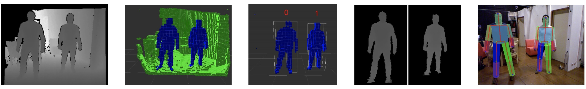

  <strong>Robust Dense Visual Odometry For RGB-D Cameras In A Dynamic Environment</strong> 
  <small>Abdallah Dib, François Charpillet</small> 
  <i>IEEE International Conference on Advanced Robotics (ICAR 2015)</i> 
  <a href="https://hal.inria.fr/hal-01212043/file/preprint.pdf">paper</a> |
  <a href="https://youtu.be/3zotv04RUcs">video</a>
    
  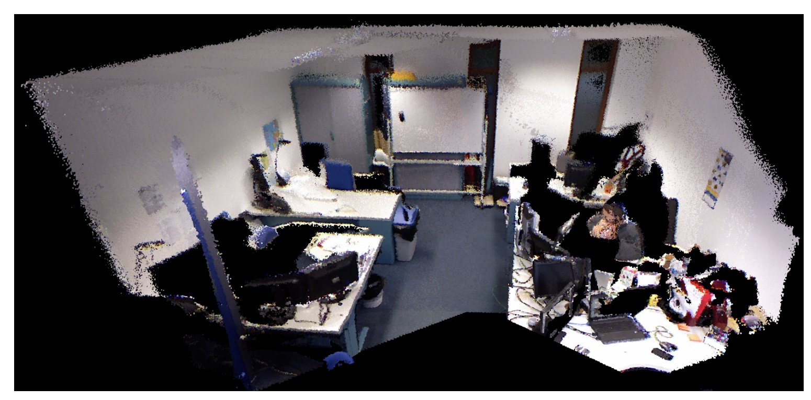

  <strong>Using Hmms for Discriminating Mobile From Static Objects in a 3D Occupancy Grid</strong> 
  <small>Dubois, Amandine and Dib, Abdallah and Charpillet, François</small> 
  <i>International Conference on Tools with Artificial Intelligence (ICTAI 2011)</i> 
  <a href="https://hal.inria.fr/file/index/docid/654041/filename/kinect.pdf">paper</a> |
	<a href="https://youtu.be/wXQ_DUkHOMc">video</a>
    
  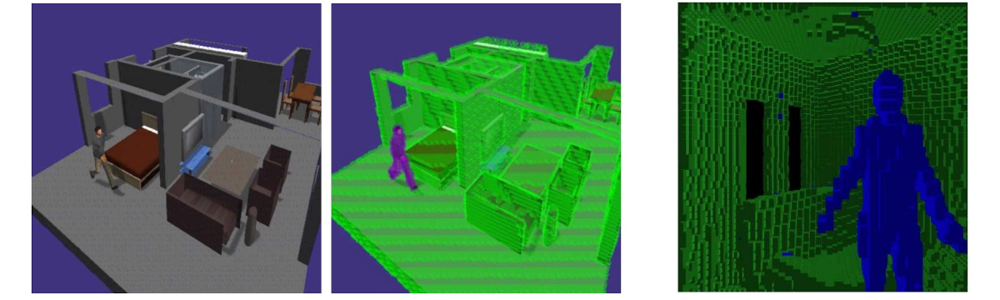

##  Personal Devs

Here you find some of my personal projects I did (and continue doing) in spare time. they are related to C++ and Graphics programming (OpenGL/GLSL), and mobile dev (iOS).

  <strong>OpenGLES 2.0 tutorials (with source code)</strong> 
  <small>In 2013, I wrote educational tutorials on Graphics programming for iOS using OpenGLES shading language. Tutorials were written in C++ with a clean and intuitive API for beginners. It covers: 3D mesh loader, camera movement, normal mappping, gpu skinning, environment mapping, shadow mapping. Code source can be found on my old website from <a href="https://virtual-vision.net/download/tutorials.zip">here</a> </small>

 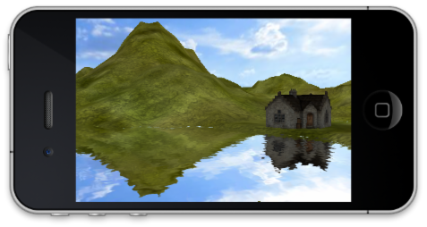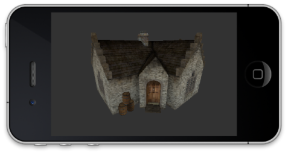
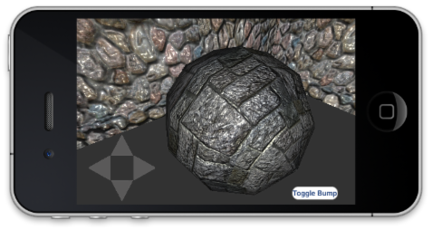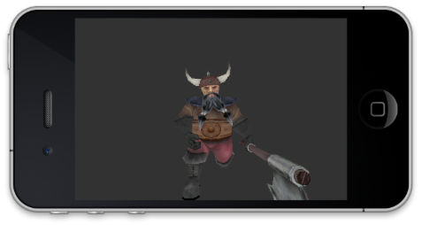

 <strong>Physically based rendering engine</strong> 
 <small>I Continue developing  and maintaining this graphics engine. It is used mainly for visualizing 3D models. it is written in  C++/OpenGL and i ported it to many platforms: windows/mac/linux/iOS/Android(via JNI)/Web(via Emiscripten). It implements physically based rendering with various BRDF models (Cook-Torrance, Phong), Deferred shading, Shadow and normal mapping. It has built-in 2D GUI support via 'imgui'. </small>

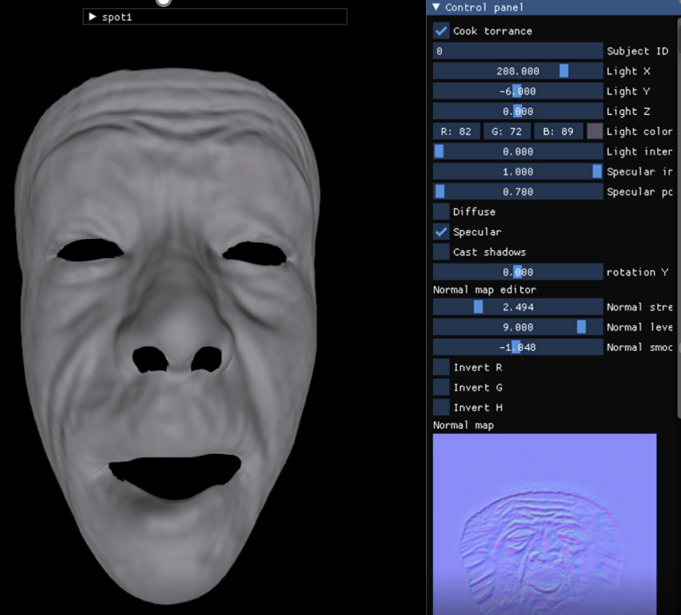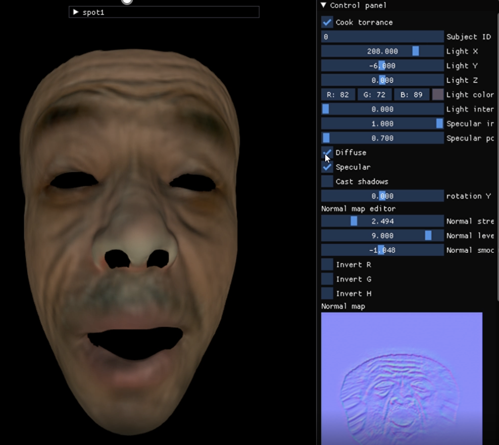

  <strong>iOS Game programming</strong> 
  <small>In 2012, I started developing mobile games and apps. In 2017, I removed these apps from App store (Because i didn't have enough time to maintain them). Below are these apps/games.  <strong>The code source for these apps can be shared upon request.</strong></small>

  <strong>Jumper buggy</strong> 
  <small>Developed in 2013. A 3D action and car simulation game for iOS. It uses the old OpenDynamics Engine for physics simulation. Written in C++/OpenGL. <a href="https://www.youtube.com/watch?v=I5MDCqC-wmQ">Video from here</a> </small>

  	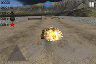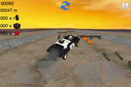
	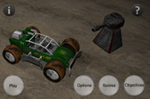

  <strong>Mosaic Puzzle</strong> 
  <small>Developed in 2014. The goal of  this educational game is to help children develop their eye<->hand coordination skills. Written in C++/OpenGL.</small>

  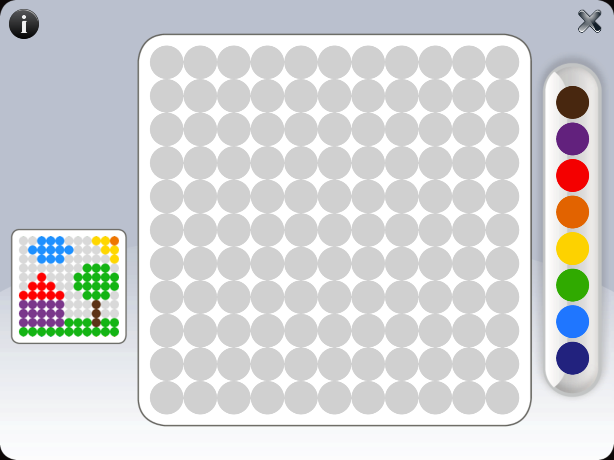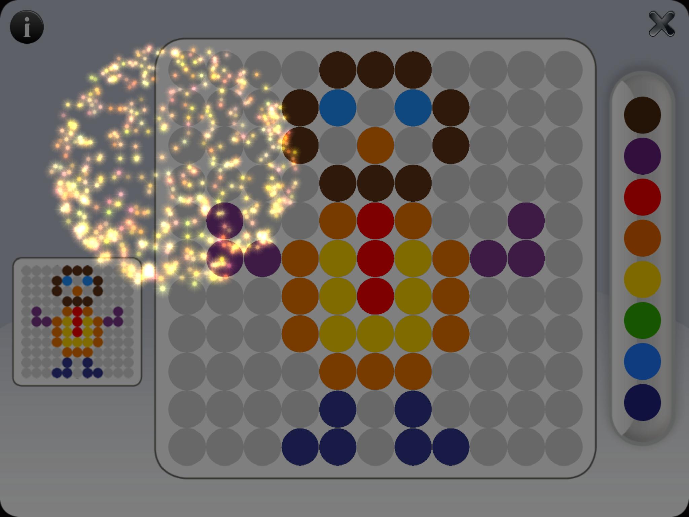

  <strong>Camera Art effects</strong> 
  <small>Developed in 2012. It is  photography application for iOS ( iPhone, iPod and iPad) that lets you apply filter and effects to your camera and in real time. It uses optimized GLSL shaders to run in realtime on an iPhone 3GS. Supported filters: Cartoon; Old Movie, Pencil, Colored Pencil, Bulge, Dent, Rain, ... Written in C++/OpenGL.</small>

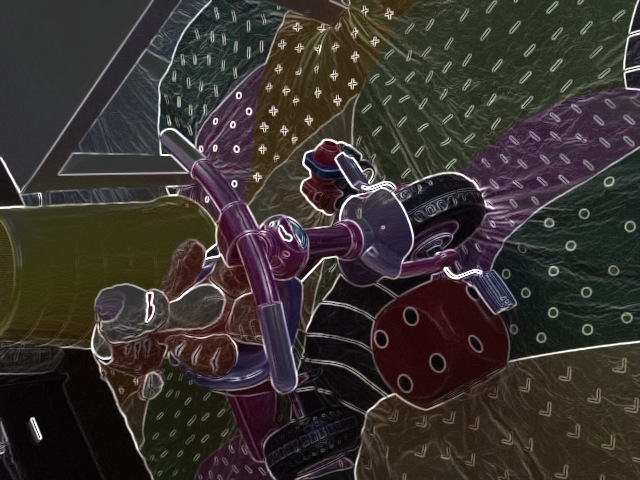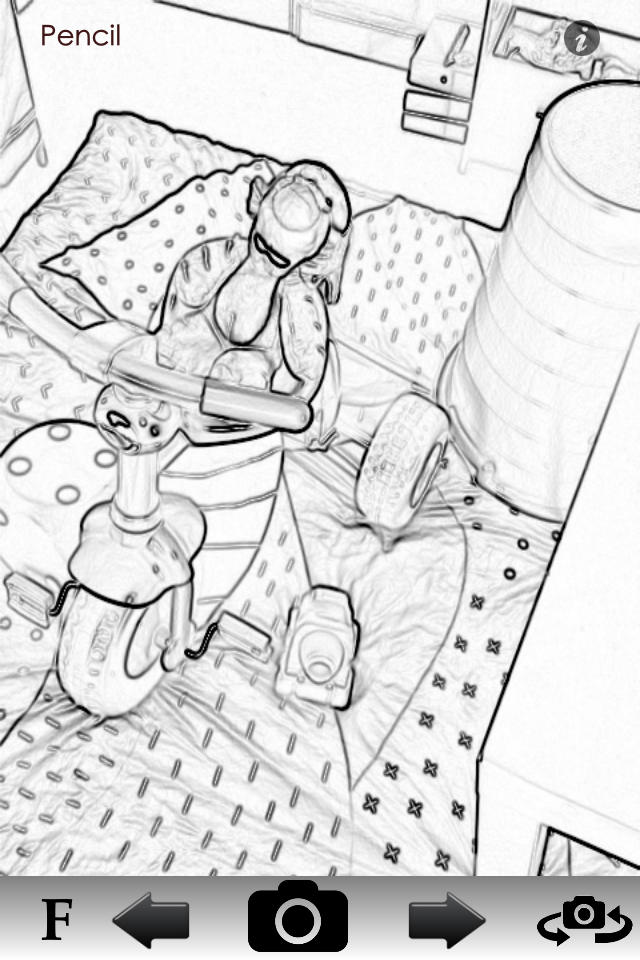
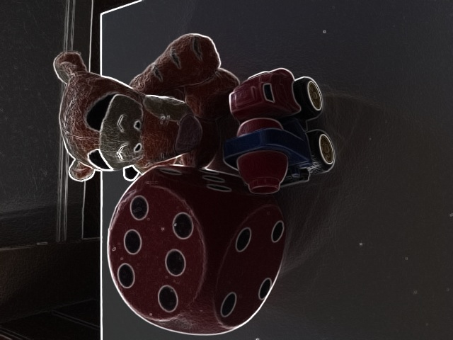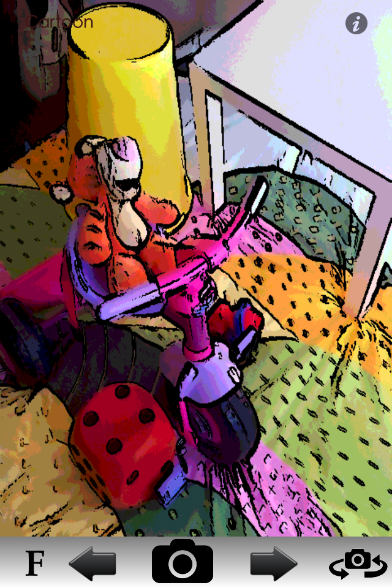

