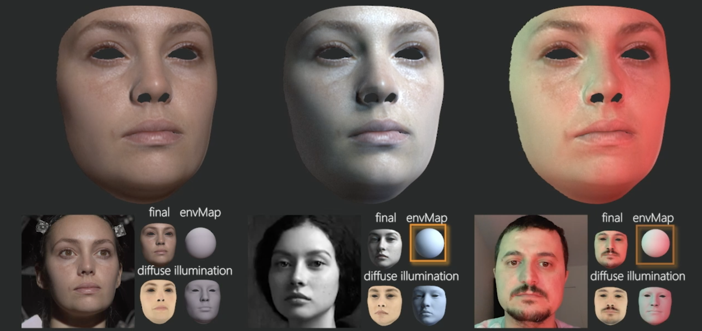

## About me

I am a research scientist working at InterDigital R&I France. Previously, I held the same position at Technicolor research and as a research engineer at Inria.
I received my Phd in Computer Science from Inria research center in 2016.

My research interests are at the intersection of computer vision, machine learning and graphics. I apply deep learning and numerical optimization for scene understanding from images and videos.

### Publications

### Programming

